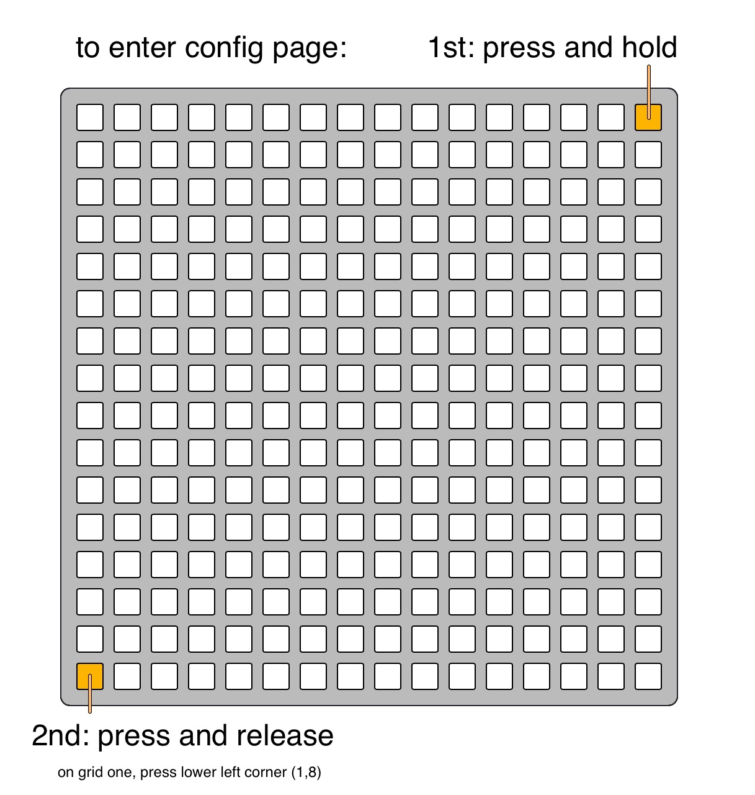
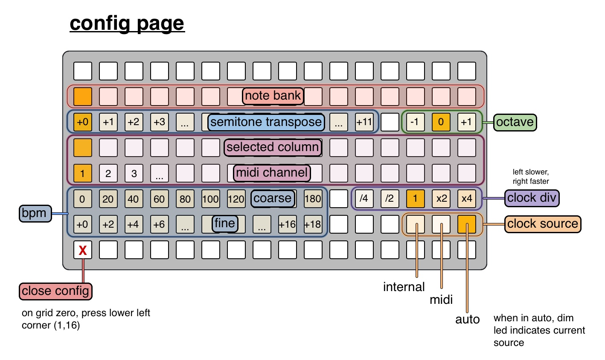

# fliiin
an [iii](https://monome.org/docs/iii/) (grid) implementation of [flin](https://monome.org/docs/grid/app/terms/#flin)

fliiin is a polyrhythmic cycling midi note generator.

each column has a segment that is falling in a virtual space that is twice as high as the grid. The grid is a window into the top half of this space. When a segment falls off the bottom of the grid, they continue falling through this space. When they hit the bottom, they wrap around back to the top. The top row is the playhead row. While a segment crosses this row (i.e. the LED is lit), that column's note is active.
- midi note on sent when the LED lights, midi note off sent when it goes dark

# usage
to create a falling segment, press keys in a column. The first key press determines the rate that the segment falls (clock division), where first row is /1, second row /2, third row /3, etc., up to /15. 2nd key (if pressed) determines the duration of the segment (i.e. note length), as the length from the top row to the row of the 2nd press. A segment starts falling after the keys are released, and starts with its front at the top of the space (i.e. it begins playing its note immediately after the keys are released).
- to stop a column, press the bottom row key of that column
- since it requires a 2nd keypress to set length of a segment, while still holding down the 1st press, you cannot set a segment's length to the same as its clock division in this way. Instead, the 2nd press on the first row will set the segment's length equal to the same row as the 1st press.
- pressing keys in a running column will recreate its segment (in accordance with the presses)
- to cancel an in-progress segment creation (you've pressed one or two keys in a column, but changed your mind and don't want to execute the segment creation), press the bottom key in that column before releasing the other keys
  - except for the bottom row to cancel the segment creation, any further key presses after the first two when creating a segment are ignored
- to reset all falling segments to the top, press and hold the upper left corner key and then press the lower right corner key

# config page
most config can be set via the [config page](#config-page), but some can only be set by [editing the script](#editing-the-script) (like the [note banks](#editing-note-banks))

## editing the script
some configuration can only be set by modifying the script itself (`fliiin.lua`), like [the note banks](#editing-note-banks).

the top of the script has a clearly marked section of variables that can be changed. You should copy this section into a new file, make your edits in that file and save it separately, then copy it back into `fliiin.lua`. This is because `fliiin.lua` will be overwritten when you update this repo, so you will need to copy in your changes again.

### editing note banks
note banks are edited by [editing the script](#editing-the-script). A note bank is an array of 16 integers in the range 0-127, corresponding to midi note numbers. The array is assigned to the desired index in the `note_banks` table.

for example, here are 3 note banks:
```lua
-- major pentatonic
note_banks[1] = { 48, 50, 52, 55, 57, 60, 62, 64, 67, 69, 72, 74, 76, 79, 81, 84 }
-- major diatonic
note_banks[2] = { 48, 50, 52, 53, 55, 57, 59, 60, 62, 64, 65, 67, 69, 71, 72, 74 }
-- minor pentatonic
note_banks[3] = { 48, 51, 53, 55, 58, 60, 63, 65, 67, 70, 72, 75, 77, 79, 82, 84 }
```

to create a fourth note bank, copy one of these lines, enter your desired notes, and set the `note_banks` index to 4 (or some other unused slot <= 16):
```lua
note_banks[1] = { 2, 4, 5, 7, 9, 11, 12, 14, 16, 17, 19, 21, 23, 24, 26, 28, }
-- ascending fourths
note_banks[2] = { 24, 29, 34, 39, 44, 49, 54, 59, 64, 69, 74, 79, 84, 89, 94, 99, }
-- ascending fifths
note_banks[3] = { 12, 19, 26, 33, 40, 47, 54, 61, 68, 75, 82, 89, 96, 103, 110, 117, }

-- minor diatonic
note_banks[4] = { 48, 50, 51, 53, 55, 56, 58, 60, 62, 63, 65, 67, 68, 70, 72, 74 }
```

you can edit the pre-existing note banks - just ensure that each note bank has 16 notes in it, otherwise the script will error on start (printing error info to [diii](https://monome.org/docs/iii/#diii) if connected).

## config page
config can be changed live via the config page.

access the config page by pressing and holding the upper right corner, then pressing the lower left corner: 

exit the config page by pressing the lower left corner key: 

- row 2: note bank, 1-16
  - the note banks can only be edit
- row 3: transposition
  - (1,3) to (12,3): semitone transposition
  - (14,3) to (16,3): octave transposition, (15,3) is no transposition, can go up or down one octave
- rows 4 and 5: select the midi channel that a column sends it note on. row 4 selects the column, and row 5 shows that column's current midi channel, press a key in row 5 to change the channel
  - the default midi channels can be changed by [editing the script](#editing-the-script)
- rows 6 and 7: clock settings
  - (1,6) to (10,6) sets interanl bpm in increments of 20, (1,7) to (10,7) adds to the row above in increments of 2
    - this bpm only applies for internal clocking
  - (12,6) to (16,6): clock divisions, where left is slower and right is faster
    - internal and midi maintain separate clock divisions
  - (14,7) to (16,7): set the clock source
    - (14,7): internal clock
    - (15,7): midi clock
    - (16,7): auto mode. When midi clock is received, internal clock is disabled and fliiin begins following the midi clock. If midi clock isn't received for several seconds, automatically switches back to internal clock.
- lower left corner key exits the config page
  - (1,16) on grid zero, (1,8) on grid one
